# WinServer Active Directory Lab
---
**A Hands-on Lab for Configuring Active Directory in Windows Server**
---

This project demonstrates the configuration of an Active Directory lab environment, including organizational units (OUs), Group Policy Objects (GPOs), DNS configurations, and login restrictions in a Windows Server environment.

---

## Table of Contents
1. [Project Objectives](#project-objectives)
2. [Steps Implemented](#steps-implemented)
    - [1. Windows Server Setup](#1-windows-server-setup)
    - [2. Configuring Active Directory](#2-configuring-active-directory)
    - [3. Configuring DNS](#3-configuring-dns)
    - [4. Setting Up Group Policies](#4-setting-up-group-policies)
    - [5. Testing and Validation](#5-testing-and-validation)
3. [Screenshots](#screenshots)
4. [Tools Used](#tools-used)
5. [Troubleshooting](#troubleshooting)
6. [Useful Links](#useful-links)
7. [License](#license)
8. [Contributions](#contributions)

---

## Project Objectives

- **Set Up Active Directory:**  
  Install and configure the Active Directory Domain Services (AD DS) role.

- **DNS Setup:**  
  Configure forward and reverse lookup zones, including DNS records.

- **Configure Organizational Units (OUs):**  
  Create and organize users, groups, and computers into OUs.

- **Create and Apply GPOs:**  
  Implement and link GPOs for login messages, admin rights, and restrictions.

- **Enforce Login Restrictions:**  
  Apply time-based login restrictions for specific users or groups.

- **Validation and Testing:**  
  Ensure all configurations are functional through controlled tests.

---

## Steps Implemented

### 1. Windows Server Setup

1. **Change the Hostname to `DC-01`:**  
   Updated the hostname to reflect the domain controller role.  
   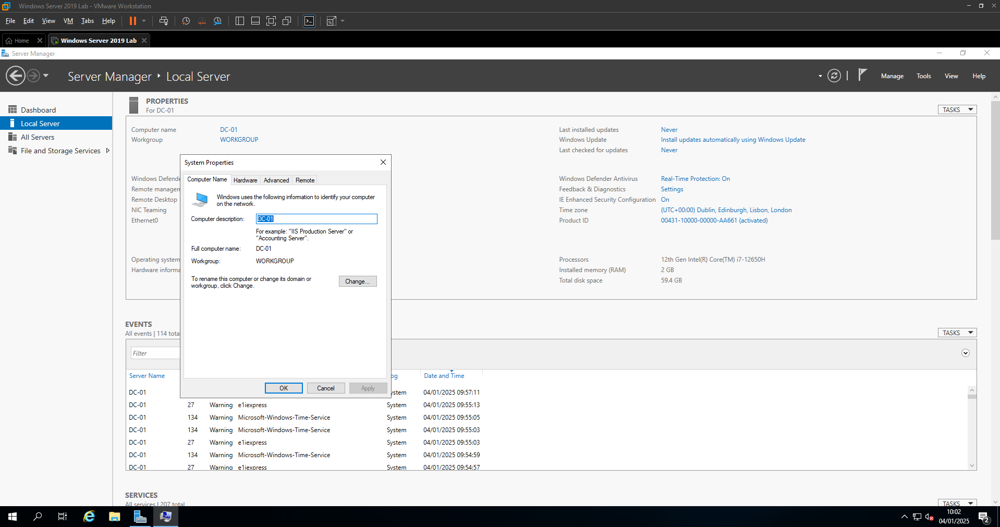

2. **Add the AD DS Role:**  
   Installed the Active Directory Domain Services role.  
   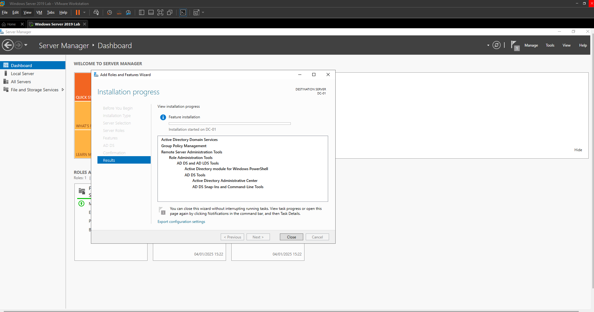

3. **Promote the Server to Domain Controller:**  
   Configured the domain name `lab.local` during promotion.  
   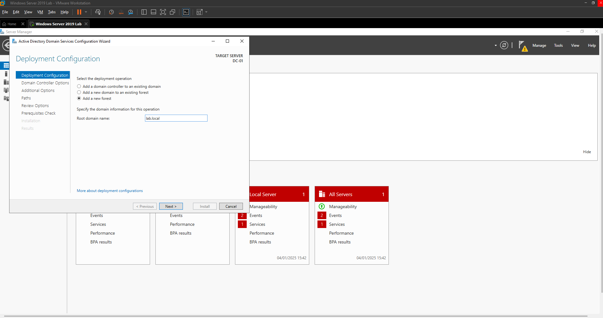  
   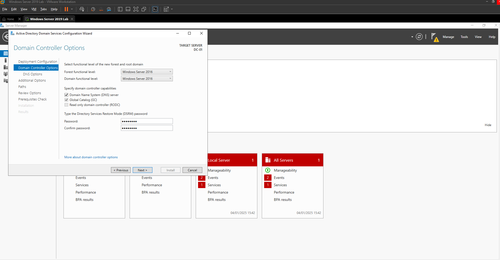

---

### 2. Configuring Active Directory

1. **Organize the Domain Structure in Active Directory Users and Computers:**  
   - Created OUs for managing users and groups efficiently.  
     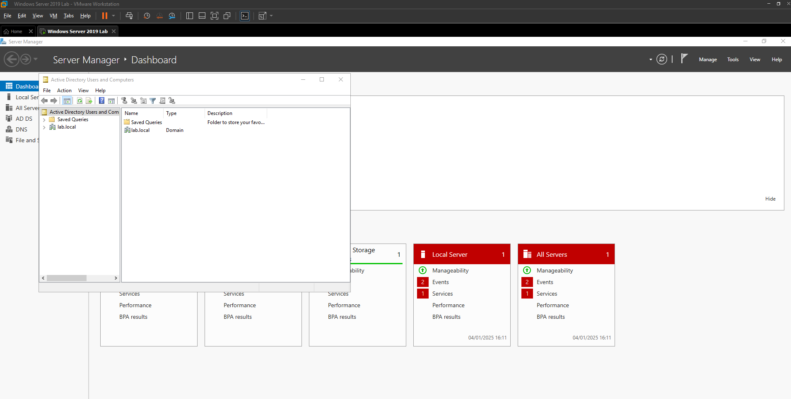

2. **Create Organizational Units (OUs):**  
   Added an OU named `IT`.  
   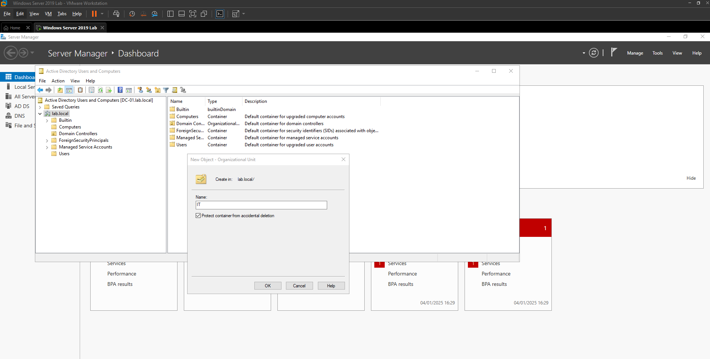

3. **Add Security Groups:**  
   - `IT_Admins` for administrators.  
   - `IT_Users` for standard users.  
   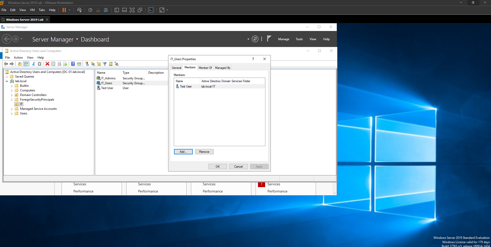

4. **Create and Assign Users:**  
   - Added `Test Admin` to the `IT_Admins` group.  
   - Added `Test User` to the `IT_Users` group.  
   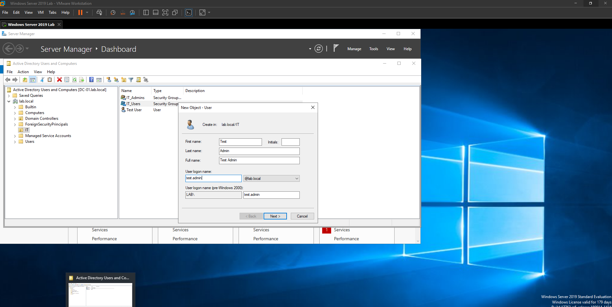

---

### 3. Configuring DNS

1. **Verify Forward Lookup Zone for `lab.local`:**  
   Ensured all required records were present.  
   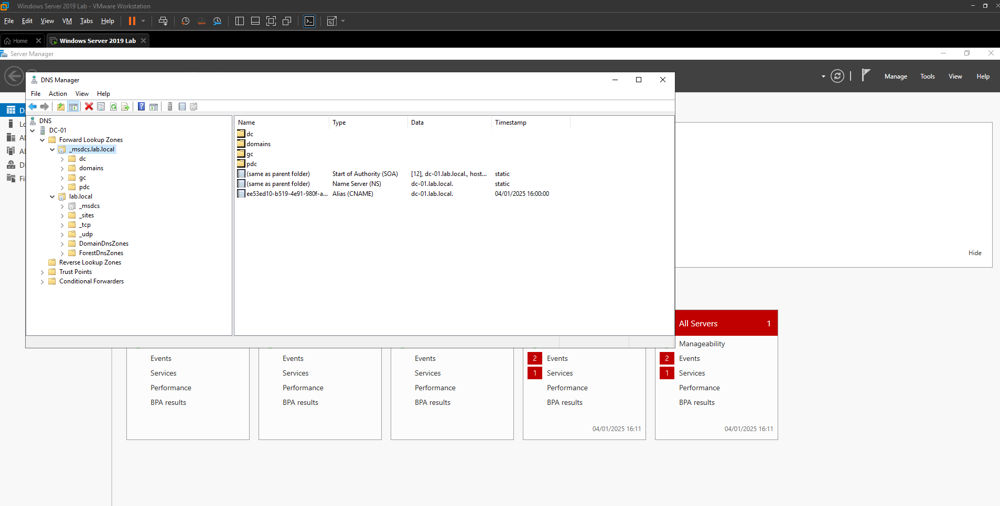

2. **Set Up Reverse Lookup Zone:**  
   - **Zone Type:** Primary Zone.  
       
   - **Network ID:** Configured the reverse lookup zone for the subnet `192.168.141.0`.  
     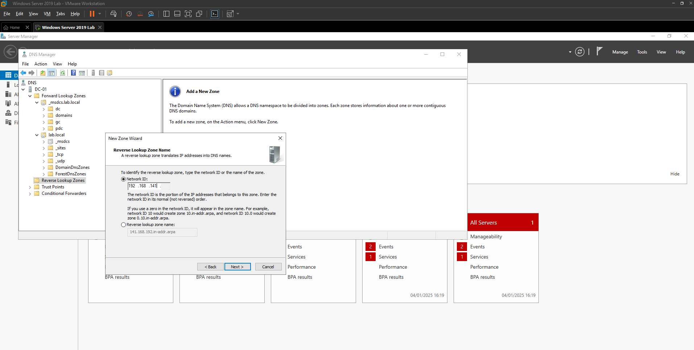  
   - **Replication Scope:** To all DNS servers running on domain controllers in `lab.local`.  
     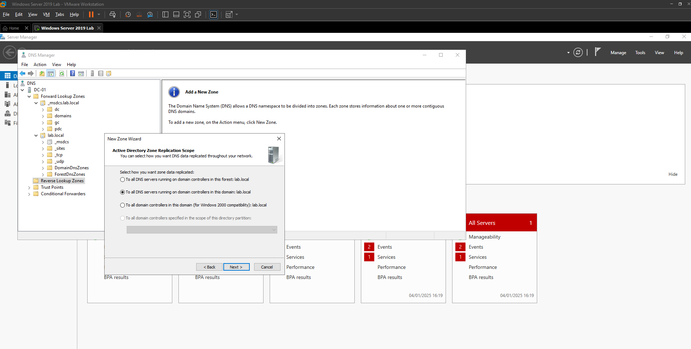

3. **Add PTR Records:**  
   Created PTR record for `DC-01`.  
   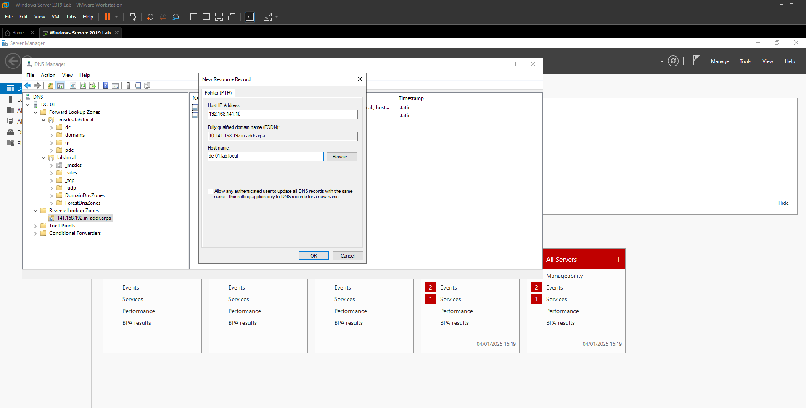

---

### 4. Setting Up Group Policies

1. **IT Login Policy:**  
   - Created a GPO for interactive login messages.  
   - Configured a message: "Welcome to LAB Domain!"  
     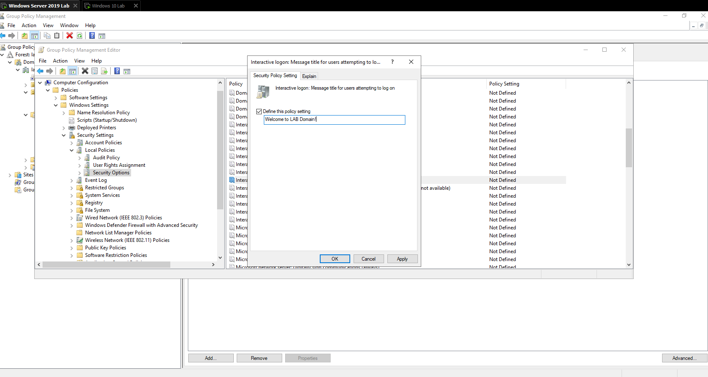

2. **IT Restrictions Policy:**  
   - Restricted Control Panel access for `IT_Users`.  
     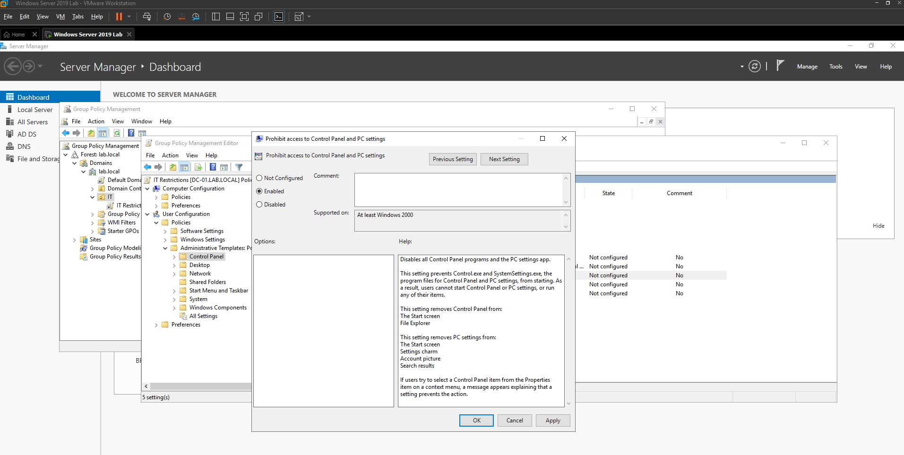

3. **Apply and Enforce GPOs:**  
   - Linked GPOs to the `IT` OU.
   - Updated policies using:
     ```bash
     gpupdate /force
     ```
     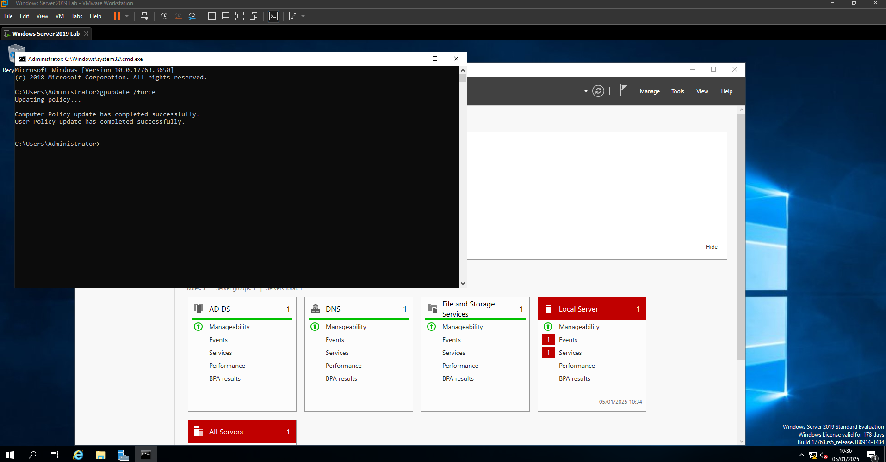

---

### 5. Testing and Validation

#### a) Verify Login Message  
- Log in using a domain account and verify the interactive login message appears.  
  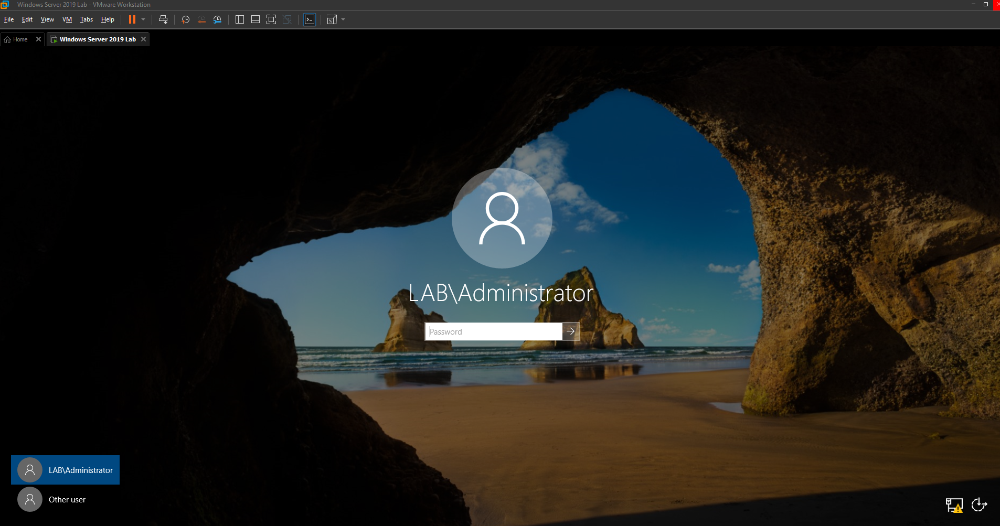

#### b) Test Control Panel Restrictions  
- Log in as a user from the `IT_Users` group and attempt to open the Control Panel.  
  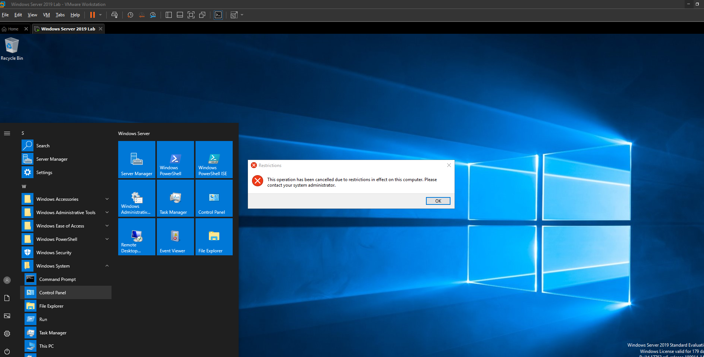

#### c) Validate DNS Records  
- Open the DNS Manager and verify forward and reverse lookup zones.  
  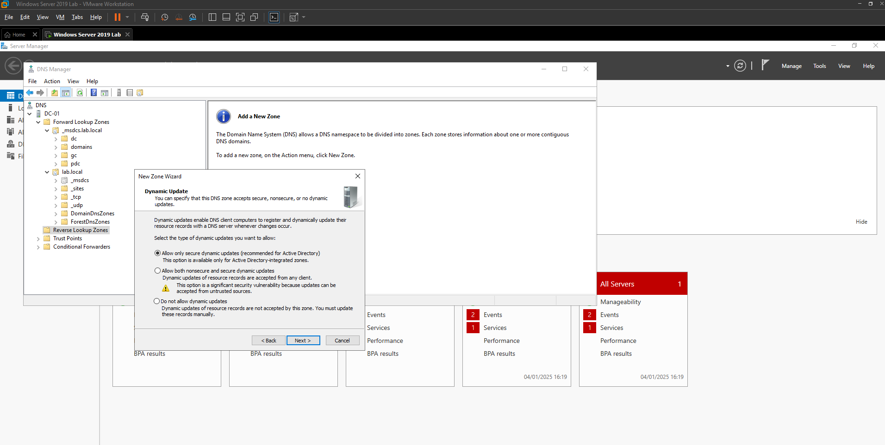

#### d) Time-Based Login Restriction Test  
- Attempt login outside of allowed hours for `IT_Users`.  
  

---

## Screenshots

1. **Active Directory Configuration**  
   - The organizational structure of Active Directory, including OUs, users, and groups.
   

2. **Changing Hostname to DC-01**  
   - Renaming the server hostname to reflect its role as a Domain Controller.
   

3. **Adding AD DS Role**  
   - Adding the Active Directory Domain Services role in Server Manager.
   

4. **Configuring the Domain Name**  
   - Setting up the domain name `lab.local` during the promotion to a Domain Controller.
   

5. **Domain Controller Options**  
   - Setting the forest and domain functional levels and defining the Directory Services Restore Mode (DSRM) password.
   

6. **Organizational Unit (OU) Creation**  
   - Creating the `IT` OU to organize users, groups, and computers.
   

7. **Group Membership Configuration**  
   - Adding users to `IT_Admins` and `IT_Users` security groups.
   

8. **DNS Forward Lookup Zone**  
   - Configuring forward lookup zones for the `lab.local` domain.
   

9. **DNS Reverse Lookup Zone - Type Selection**  
   - Selecting the zone type as `Primary Zone`.
   

10. **DNS Reverse Lookup Zone - Network ID**  
    - Configuring the reverse lookup zone for the subnet `192.168.141.0`.
    

11. **DNS Reverse Lookup Zone - Replication Scope**  
    - Setting the replication scope to all DNS servers running on domain controllers in the `lab.local` domain.
    

12. **Adding PTR Record**  
    - Adding a PTR record for `DC-01` in the reverse lookup zone.
    

13. **DNS Final Configuration View**  
    - Final view of DNS Manager after configuring forward and reverse lookup zones.
    

14. **IT Login Policy Configuration**  
    - Setting up an interactive logon message GPO for domain users.
    

15. **Interactive Logon Message Screen**  
    - The custom logon message displayed during user sign-in.
    

16. **Control Panel Restriction GPO**  
    - Restricting access to Control Panel and PC Settings for users in `IT_Users`.
    

17. **Validating GPO with gpupdate**  
    - Updating and enforcing GPOs on the domain using `gpupdate /force`.
    

18. **GPO Update Command Output**  
    - Verifying the successful application of computer and user policies.
    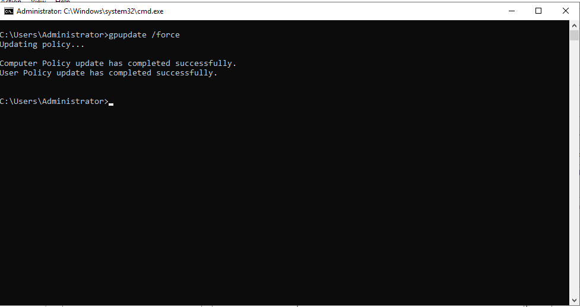


---

## Tools Used

- **Windows Server 2019**  
- **Windows 10 Pro**  
- **VMware Workstation Pro**  
- **PowerShell and CMD**

---

## Troubleshooting

### GPO Not Applying  
- **Resolution:** Ensure proper linkage and use `gpupdate /force`.  

### Login Message Not Appearing  
- **Resolution:** Verify the GPO settings and restart the client.

---

## Useful Links

- [Microsoft Active Directory Documentation](https://learn.microsoft.com/en-us/windows-server/identity/active-directory-domain-services)  
- [Group Policy Management](https://learn.microsoft.com/en-us/windows-server/identity/gpmc-overview)  
- [DNS Setup](https://learn.microsoft.com/en-us/windows-server/networking/dns/dns-top)

---

## License

Licensed under the [MIT License](./LICENSE).

---

## Contributions

Feel free to contribute to this project via pull requests or issues.
